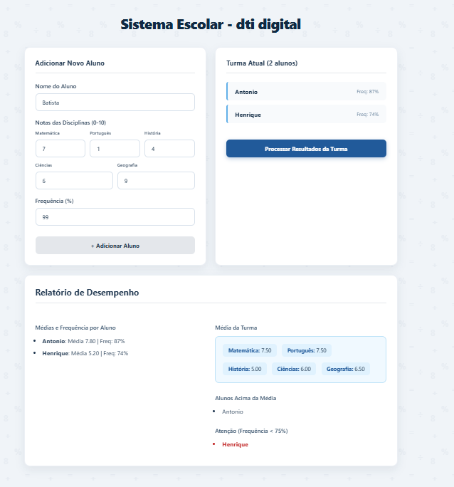
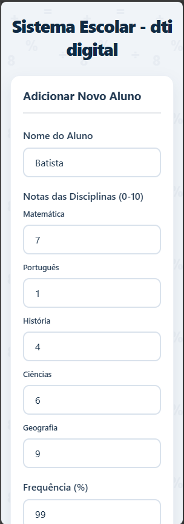
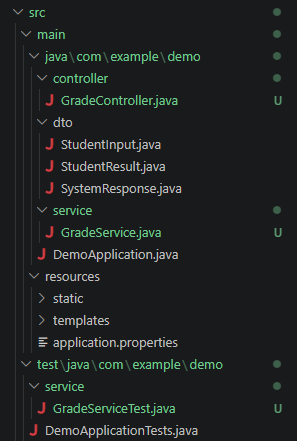

# 🎓 Sistema de Processamento de Notas - dti digital

Este projeto foi desenvolvido como resolução do desafio técnico para a vaga de estágio na dti digital. O sistema permite o cadastro de alunos com as suas respetivas notas e frequência, processando esses dados no back-end para gerar um relatório de desempenho da turma.

---

## 📸 Demonstração do Sistema

### Versão para Computador (Desktop)
Aqui pode ver o painel principal com o formulário de entrada e os resultados da turma processados.

### Versão Mobile (Responsividade)
O design foi construído com foco na experiência do utilizador em qualquer dispositivo, adaptando-se para ecrãs pequenos.

  

### Estrutura do Projeto
O back-end foi organizado seguindo padrões de mercado, com separação clara de Controller, Service e DTO.

---

## 🚀 Tecnologias e Boas Práticas Utilizadas

O projeto foi construído com uma arquitetura Full-stack, separando claramente as responsabilidades entre o cliente e o servidor:

**Back-end (API REST):**
* **Java & Spring Boot:** Lógica de negócio e rotas da API.
* **Padrão DTO com Records:** Uso de `Records` do Java moderno para imutabilidade e tráfego limpo de dados (`StudentInput`, `StudentResult`, `SystemResponse`).
* **JUnit 5:** Testes unitários garantindo a precisão dos cálculos matemáticos e regras de negócio do `GradeService`.

**Front-end (Interface Web):**
* **React.js:** Construção da interface de utilizador de forma reativa.
* **CSS Responsivo (Media Queries):** Design adaptável que funciona perfeitamente em ecrãs de computador, tablets e telemóveis.
* **Jest & React Testing Library:** Testes automatizados de interface para garantir o funcionamento correto dos alertas e renderização dos dados.

---

## ⚙️ Como executar o projeto localmente

Para testar a aplicação na sua máquina, precisará de ter o **Java (JDK)** e o **Node.js** instalados.

### 1. Iniciar o Back-end (Spring Boot)
O back-end utiliza o Maven Wrapper, pelo que não precisa de ter o Maven instalado globalmente.

1. Abra um terminal na pasta raiz do projeto (`PROJETOESTAGIO`).
2. Execute o comando para iniciar o servidor:
   * No Windows: `mvnw spring-boot:run`
   * No Linux/Mac: `./mvnw spring-boot:run`
3. A API estará a correr em `http://localhost:8080`.

### 2. Iniciar o Front-end (React)
1. Abra **outro** terminal (mantenha o back-end a correr).
2. Navegue para a pasta do front-end: `cd frontend`
3. Instale as dependências do projeto: `npm install`
4. Inicie a aplicação web: `npm start`
5. O sistema abrirá automaticamente no seu browser em `http://localhost:3000`.

---

## 🧪 Como correr os Testes Automatizados

A qualidade do código foi garantida através de testes unitários em ambas as camadas do projeto.

* **Para testar o Back-end (Cálculos e Lógica):**
    Na pasta raiz do projeto, execute:
    `./mvnw test` (ou `mvnw test` no Windows)

* **Para testar o Front-end (Interface e Validações):**
    Na pasta `frontend`, execute:
    `npm test`

---

## 💡 Funcionalidades Entregues
- [x] Registo de alunos com nome, 5 notas e % de frequência.
- [x] Bloqueio de inputs inválidos (ex: notas > 10 ou < 0).
- [x] Processamento da média individual de cada aluno.
- [x] Cálculo da média geral da turma.
- [x] Cálculo da média da turma por disciplina.
- [x] Identificação de alunos acima da média geral.
- [x] Alerta para alunos com frequência inferior a 75%.
- [x] Interface 100% responsiva (Mobile-friendly).

---
### 🎥 Veja o vídeo de apresentação

---

*Desenvolvido com dedicação para o processo seletivo da dti digital.*